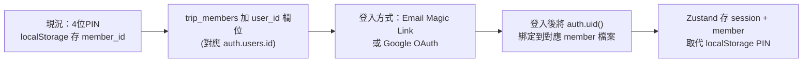
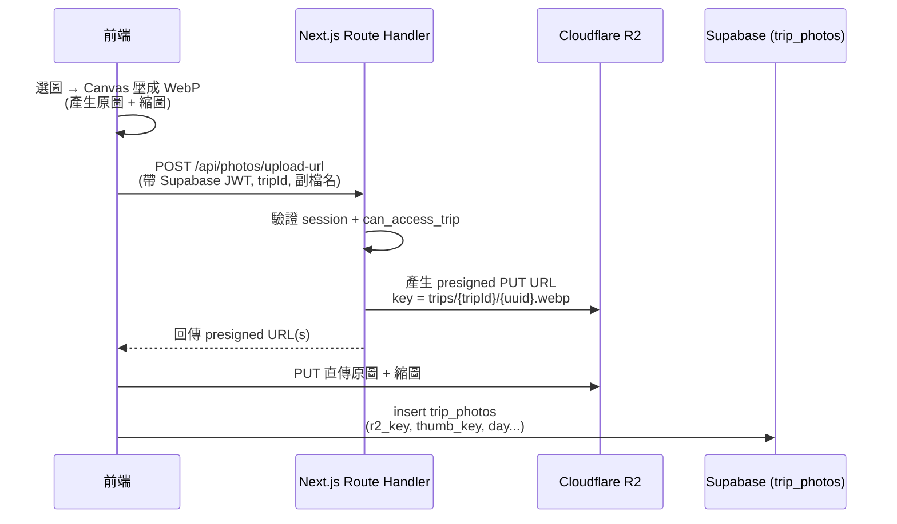

# Travel Record App — 重構與架構設計藍圖

> 版本：v1.0 (Redesign Plan)
> 撰寫日期：2026-06-15
> 目標版本：v0.4.0 → v1.0.0
> 範圍：前端視覺 + 架構雙重重構、Supabase Auth + RLS、照片儲存遷移至 Cloudflare R2

---

## 0. 為什麼要先定框架

目前的程式碼能跑，但有幾個結構性問題會讓「新增功能」越來越痛：

- 每個頁面 400~550 行，邏輯 / 狀態 / UI 全混在一起。
- 沒有資料層，每頁各自寫 `fetchData()`，重複抓全域資料。
- 沒有狀態管理，跨頁靠 URL 參數 + 重新 fetch。
- 認證只有 PIN + localStorage，資料表無 RLS（任何人拿到 anon key 就能讀寫全部資料）。
- 照片塞在 Supabase Storage，量大後成本與空間都吃緊。

這份文件把「目標架構」一次定義清楚，後續每個功能都照同一套規範長出來，不再各寫各的。

---

## 1. 目標與設計原則

| 原則 | 說明 |
|------|------|
| **分層清楚** | UI / 狀態 / 資料存取 / 服務（R2、Auth）各自獨立，可單獨測試與替換。 |
| **頁面薄、功能模組厚** | `app/` 的頁面只負責「組裝」，真正邏輯放進 `features/` 模組。 |
| **單一資料來源** | 伺服器狀態統一交給 TanStack Query 快取，不再各頁重抓。 |
| **預設安全** | 所有資料表開 RLS；R2 上傳一律經伺服器端驗證 + 簽名。 |
| **漸進遷移** | 不打掉重練，分階段切換，每階段都可獨立上線。 |

---

## 2. 整體架構分層

```mermaid
flowchart TD
    subgraph Client["瀏覽器 (Next.js Client)"]
        UI["UI 層<br/>design-system primitives + feature components"]
        SM["狀態層<br/>TanStack Query (server state)<br/>Zustand (UI / 當前使用者)"]
        DL["資料存取層<br/>features/*/api.ts + hooks"]
    end

    subgraph Edge["Next.js Server (Vercel)"]
        RH["Route Handlers / Server Actions<br/>驗證 Supabase session"]
        R2SIGN["R2 presigned URL 簽發"]
    end

    subgraph Services["外部服務"]
        SB[("Supabase<br/>Postgres + Auth + Realtime")]
        R2[("Cloudflare R2<br/>照片物件儲存")]
        CDN["Cloudflare CDN<br/>(自訂網域，圖片交付)"]
    end

    UI --> SM --> DL
    DL -->|查詢/寫入 (帶 JWT)| SB
    DL -->|要 presigned URL| RH --> R2SIGN -->|簽名| R2
    UI -->|PUT 直傳| R2
    R2 --> CDN -->| 讀取| UI
    SB -.->|Realtime 推播| SM
```

重點：照片的「上傳簽名」走 Next.js 伺服器（短、低頻、需驗證），照片的「直傳」與「讀取」則繞過伺服器直接對 R2 / CDN，省頻寬也省 Vercel function 時間。

---

## 3. 技術選型決策

| 領域 | 選擇 | 理由 |
|------|------|------|
| **框架** | 維持 Next.js 16 App Router | 已在用，且 Route Handler 正好用來簽 R2 URL。 |
| **伺服器狀態** | **TanStack Query (React Query)** | 取代散落的 `fetchData()`，自帶快取、重試、樂觀更新；與 Realtime 結合好做。 |
| **UI / 全域狀態** | **Zustand** | 輕量，管「當前登入成員、當前 trip、側欄開關、Toast」等小狀態。 |
| **認證** | **Supabase Auth**（建議 Email Magic Link 或 Google OAuth） | 朋友間旅遊 App，低摩擦登入；JWT 直接餵 RLS。 |
| **資料安全** | **RLS（Row Level Security）** | 以「使用者是否屬於該 trip 的 group」決定可讀寫範圍。 |
| **照片儲存** | **Cloudflare R2** + 自訂網域 CDN | 零 egress 費用，解決照片量大成本問題。 |
| **R2 上傳** | **Next.js Route Handler 簽 presigned PUT URL** | 單一程式碼庫 / 單一部署；可在簽名前驗證 Supabase session。 |
| **R2 SDK** | `@aws-sdk/client-s3` + `@aws-sdk/s3-request-presigner` | R2 相容 S3 API，用標準 SDK 即可。 |
| **縮圖** | 上傳前在前端用 Canvas 壓成 WebP（縮圖 + 原圖各一份） | 不依賴額外服務，省 R2 空間與讀取流量。 |
| **設計系統** | Tailwind 4 + CSS variables tokens + 自建 primitives | 維持現有彈性，統一視覺語言。 |

> 為什麼不選 Cloudflare Worker 簽名：Worker 的低延遲對「上傳簽名」這種低頻動作幾乎沒差，卻多一個部署環境、多一份 secret 管理、還要處理跨網域 session 驗證。等未來真的要做邊緣圖片轉換（Image Resizing）再引入 Worker 不遲。

---

## 4. 重構後目錄結構

採 **feature-based** 結構，把同一功能的 UI / hooks / API 收在一起：

```
my-trip-app/
├── app/                          # 路由層（薄，只負責組裝 + layout）
│   ├── (auth)/login/page.tsx     #   登入頁
│   ├── page.tsx                  #   旅程列表
│   ├── trip/[id]/...             #   各 trip 子頁
│   └── api/
│       └── photos/
│           └── upload-url/route.ts   # R2 presigned URL 簽發
│
├── features/                     # 功能模組（厚，邏輯放這）
│   ├── trips/      { components/, hooks/, api.ts }
│   ├── itinerary/  { components/, hooks/, api.ts }
│   ├── expenses/   { components/, hooks/, api.ts, settle.ts }
│   ├── photos/     { components/, hooks/, api.ts, r2-upload.ts }
│   ├── plan/       { ... }
│   ├── memo/  journal/  members/  groups/
│   └── auth/       { hooks/useSession.ts, ... }
│
├── components/
│   └── ui/                       # 設計系統 primitives（Button/Card/Input/Sheet/Dialog...）
│   └── (既有共用：Toast/Modal/Lightbox/Skeleton...)
│
├── lib/
│   ├── supabase/
│   │   ├── client.ts             # 瀏覽器端 client
│   │   └── server.ts             # 伺服器端 client（讀 cookie / session）
│   ├── r2.ts                     # R2 (S3) client 設定
│   ├── query-client.ts           # TanStack Query 設定
│   └── image.ts                  # 前端壓縮/縮圖工具
│
├── stores/                       # Zustand stores（currentMember / ui）
├── types/                        # 由 lib/types.ts 拆分而來
└── REDESIGN_ARCHITECTURE.md      # 本文件
```

---

## 5. 資料層與狀態管理

### 5.1 資料存取（每個 feature 一份 `api.ts`）

把所有 Supabase 查詢從頁面抽出來，集中在各 feature 的 `api.ts`，再用 TanStack Query 包成 hook：

```ts
// features/expenses/api.ts
export const expensesApi = {
  list: (tripId: string) =>
    supabase.from('trip_expenses').select('*').eq('trip_id', tripId),
  create: (payload: NewExpense) =>
    supabase.from('trip_expenses').insert(payload),
  // ...
};

// features/expenses/hooks/useExpenses.ts
export function useExpenses(tripId: string) {
  return useQuery({
    queryKey: ['expenses', tripId],
    queryFn: () => expensesApi.list(tripId).then(unwrap),
  });
}
```

頁面從此只做：呼叫 hook → 拿資料 → 丟給元件。原本 500 行的頁面可瘦到 ~100 行組裝邏輯。

### 5.2 Realtime 與快取整合

Supabase Realtime 收到 `postgres_changes` 時，呼叫 `queryClient.invalidateQueries(['expenses', tripId])` 讓快取自動更新，取代現在「手動 setState 拼湊」的寫法。寫入時用 `useMutation` 的樂觀更新，UI 反應更即時。

### 5.3 全域狀態（Zustand）

只放真正跨頁的小狀態：當前登入成員（取代 localStorage 的 `my_member_id`）、當前 trip context、側欄/底欄 UI 狀態。其餘一律走 Query 快取，不重複造輪子。

---

## 6. 認證（Supabase Auth）與 RLS

### 6.1 從 PIN 遷移到 Supabase Auth



**採 Email Magic Link**（已確認）。自用情境免記密碼、免管 OAuth 設定，最低摩擦。首次登入時讓使用者把帳號關聯到既有的 `trip_members` 紀錄（或自動建立），在 `trip_members` 增加 `user_id uuid references auth.users`。

### 6.2 RLS 政策設計（核心）

權限模型：**使用者能存取一個 trip，當且僅當他屬於該 trip 所屬的 group**。用一個 helper 函式判斷成員資格，再套到各表：

```sql
-- 判斷目前登入者是否為某 member
create function is_me(member uuid) returns boolean
  language sql security definer stable as $$
  select exists(select 1 from trip_members m
                where m.id = member and m.user_id = auth.uid());
$$;

-- 判斷目前登入者是否能存取某 trip（屬於該 trip 的 group）
create function can_access_trip(t uuid) returns boolean
  language sql security definer stable as $$
  select exists(
    select 1 from trips tr
    join group_members gm on gm.group_id = tr.group_id
    join trip_members m on m.id = gm.member_id
    where tr.id = t and m.user_id = auth.uid()
  );
$$;

-- 範例：trip_expenses 只開放給能存取該 trip 的人
alter table trip_expenses enable row level security;
create policy "members can read"   on trip_expenses for select using (can_access_trip(trip_id));
create policy "members can write"  on trip_expenses for insert with check (can_access_trip(trip_id));
create policy "members can modify" on trip_expenses for update using (can_access_trip(trip_id));
create policy "members can delete" on trip_expenses for delete using (can_access_trip(trip_id));
```

對 10 張表逐一開 RLS：以 `trip_id` 為主的表用 `can_access_trip()`；`trip_members` / `groups` / `group_members` 用對應的成員/群組規則。**這是這次安全升級最重要的一步。**

> 注意：開 RLS 後，現有「無登入直接讀寫」的程式會立刻失效，所以 Auth 與 RLS 必須同一階段一起上（見路線圖 Phase 2）。

---

## 7. 照片儲存：Cloudflare R2 架構

> **現況**：照片目前全部存在個人 Google Drive，前端只存「Drive 連結」。問題有二：(1) Drive 連結做不出圖片預覽 / 瀑布流（masonry）效果，(2) 長期佔用個人雲端空間。改用 R2 後，照片由 App 自己掌控、可直接出縮圖與瀑布流，且不再吃個人 Drive 空間。

### 7.1 上傳流程（presigned PUT）



### 7.2 圖片交付

R2 公開讀取、前端 `` 直接指向，**egress 免費**，這正是解決「照片變多」成本問題的關鍵。縮圖列表載 thumb、Lightbox 才載原圖。

> **網域現況（已確認）**：目前沒有自訂網域。先用 R2 內建的公開網址（`*.r2.dev`）即可上線，自用流量完全夠；日後想要更專業或更高速度上限時，再買一個便宜網域掛上 Cloudflare CDN 即可，程式只需改 `R2_PUBLIC_BASE_URL` 一個環境變數，無痛切換。

### 7.3 資料表調整（`trip_photos`）

現有 `url / storage_path / is_storage` 改為更通用的欄位：

| 欄位 | 用途 |
|------|------|
| `storage_provider` | `'r2' \| 'gdrive' \| 'supabase'`（相容舊資料） |
| `r2_key` | R2 物件 key（原圖） |
| `thumb_key` | 縮圖 key |
| `external_url` | 給 Google Drive 連結模式沿用 |

### 7.4 既有照片遷移（從 Google Drive）

既有照片都在 Google Drive，提供兩種策略，可二選一或混用：

- **方案 A — 只往前走（最省事）**：舊照片維持 Drive 連結存在 `external_url`，新照片一律進 R2。缺點是舊照片仍沒有瀑布流/縮圖效果，且仍佔 Drive 空間。
- **方案 B — 完整遷移（建議，能真正解決兩個痛點）**：寫一支一次性腳本，透過 Google Drive API 下載既有照片 → 壓成 WebP + 縮圖 → 上傳 R2 → 更新 `trip_photos` 的 provider/key。遷移驗證無誤後即可釋出 Drive 空間。

> **資料量（已確認）**：現有照片約 **1.76 GB**。壓成 WebP 後會更小，完全落在 **R2 免費額度（10 GB 儲存）內**，所以採 **方案 B 完整遷移** 是可行且划算的；腳本可一次跑完、不需分批。

### 7.5 需要的環境變數

```
R2_ACCOUNT_ID=
R2_ACCESS_KEY_ID=
R2_SECRET_ACCESS_KEY=        # 只放在伺服器端，前端永遠拿不到
R2_BUCKET=trip-photos
R2_PUBLIC_BASE_URL=https://img.yourdomain.com
```

---

## 8. 新功能設計：內建地圖與行程建議

目標：把「每次都要切去 Google Map」變成 App 內建體驗——地圖直接顯示行程點、點地圖就能加景點、再進一步給「建議景點 / 建議行程」（參考 Funliday：輸入目的地與天數即推薦景點與排序，並自動算交通時間）。

### 8.1 能力拆解與分期

| 子功能 | 說明 | 期別 |
|--------|------|:---:|
| **內建地圖檢視** | 行程頁/規劃頁嵌入地圖，把當天行程點標在地圖上、連成路線。取代切換 Google Map。 | P5a |
| **地圖選點加行程** | 在地圖上搜尋/點選 POI，直接加入行程或備選池（`trip_bucket_list`）。 | P5a |
| **交通時間/路線** | 自動計算相鄰行程點的交通時間與路線（駕駛/步行/大眾運輸）。 | P5b |
| **建議景點** | 依目的地座標推薦附近熱門 POI（含評分、照片、營業時間）。 | P5b |
| **建議行程（AI）** | 輸入目的地+天數→產生一份可編輯的初步行程（POI + 排序）。 | P5c（進階） |

### 8.2 技術選型建議

研究後的取捨：**地圖底圖**與 **POI 資料**分開選，CP 值最高。

| 角色 | 建議 | 理由 |
|------|------|------|
| **地圖底圖 / 標記 / 路線繪製** | **Leaflet（已安裝）+ 明亮風格 tile**（MapTiler 或 Mapbox 的 raster tile） | 已在依賴內、輕量；明亮風 tile 符合「出遊」調性。 |
| **POI 資料（建議景點）** | **Google Places API**（Nearby/Text Search） | 2026 比較後，POI 的評分、照片、營業時間資料 Google 仍最完整，無人能完全取代；自用低用量在免費額度內。 |
| **交通時間 / 路線** | 先用 **OSRM（開源、免費）** 或 Google Directions，視需求 | OSRM 免費自架/公用實例足夠自用；要大眾運輸再上 Google。 |
| **建議行程（AI）** | 呼叫 LLM，把選定區域/POI + 天數丟進去產生排程草稿 | 等同 Funliday 的 AI 小幫手；列為進階、可選。 |

> 為什麼底圖用 Leaflet 而非全套 Mapbox/Google Maps JS：底圖只要顯示與畫線，Leaflet 就夠且最省成本；真正值錢的是 Google 的 **Places 資料**，所以只在「要 POI 內容」時打 Google Places，其餘用免費方案。這樣能把費用壓在自用免費級距。

### 8.3 架構落點（與既有設計一致）

所有第三方金鑰（Google Places、MapTiler）一律放伺服器端，前端透過 **Next.js Route Handler 代理**呼叫，跟 R2 簽名同一套模式：

```
app/api/places/search/route.ts     # 代理 Google Places，隱藏金鑰、可加 RLS 檢查
app/api/places/nearby/route.ts     # 建議景點
app/api/route/matrix/route.ts      # 交通時間（OSRM/Google）
features/map/                       # 地圖元件 + hooks（Leaflet 封裝）
features/suggestions/               # 建議景點 / AI 行程
```

地圖選到的 POI 寫回既有的 `trip_bucket_list`（備選池）或 `trip_itinerary`，**不需大改資料表**；`trip_itinerary` 已有 `map_url`，可再加 `lat / lng` 欄位以便畫點與算路線。

### 8.4 需要的環境變數（新增）

```
GOOGLE_PLACES_API_KEY=        # 伺服器端，前端拿不到
MAPTILER_KEY= (或 Mapbox token)  # 底圖 tile
```

---

## 9. 前端設計系統（視覺重構）

**視覺方向（已確認）**：偏明亮、輕快、出遊感；參考 Funliday / chicTrip 的卡片化、地圖導向、照片優先，但走**更個人化**的調性（自用的小團體 App，而非工具感重的大眾平台）。**定案主題：湖水青旅（明亮冷色系）**，色票見 9.1。

| 項目 | 做法 |
|------|------|
| **色彩基調** | 明亮底（近白/淺米），搭一個溫暖旅遊系主色（如珊瑚橘或湖水綠）＋輔助色；大量留白。 |
| **Design Tokens** | 在 CSS variables / Tailwind theme 定義色彩、間距、圓角（偏大圓角更親和）、陰影、字級，全站統一。 |
| **UI Primitives** | 自建 `components/ui/`：Button、Card、Input、Select、Sheet、Dialog、Tabs、Badge 等，取代各頁手寫樣式。 |
| **照片優先** | 卡片與列表以圖為主角，呼應 R2 帶來的縮圖/瀑布流能力。 |
| **保留特色元件** | 行程頁的 3D 弧形日期選擇器、支出進度條等是亮點，重構時封裝成獨立元件保留。 |
| **版面** | 統一 App Shell（側欄 + 底欄）、一致的頁首/空狀態/載入骨架。 |
| **RWD** | 行動優先（出遊在手機上用）。明亮為主，深色模式可後續再加。 |
| **錯誤邊界** | 加 React Error Boundary + 全站統一的 error / empty / loading 狀態。 |

### 9.1 定案色票：湖水青旅（已確認）

明亮冷色系，清爽戶外感。以 CSS variables 定義，P0 即落地：

```css
:root {
  /* 色彩 */
  --color-primary:        #1D9E75;  /* 主色：按鈕、連結、重點 */
  --color-primary-strong: #0F6E56;  /* 主色深：色塊上的文字 */
  --color-accent:         #5DCAA5;  /* 輔助：標籤、次要強調 */
  --color-accent-soft:    #CDEEE2;  /* 輕量底：pill / 封面占位 */
  --color-bg:             #F2FAF7;  /* 頁面底色 */
  --color-surface:        #FFFFFF;  /* 卡片表面 */
  --color-text:           #1F2A27;  /* 主要文字 */
  --color-text-muted:     #6B7C77;  /* 次要文字 / 說明 */
  --color-border:         rgba(0,0,0,0.07);

  /* 字級（兩種字重：400 / 500） */
  --text-h1: 22px; --text-h2: 18px; --text-h3: 16px;
  --text-body: 14px; --text-caption: 12px;

  /* 圓角與間距 */
  --radius-card: 12px; --radius-control: 9px; --radius-pill: 999px;
}
```

> 深色模式可後續再加（對應一組暗色 token）；目前以明亮為主。語意色（success/warning/danger）另定，但主色調以上表為準。

---

## 10. 分階段實作路線圖

每個 Phase 都能獨立上線，不會卡在半成品。

| Phase | 內容 | 產出 | 可獨立上線 |
|-------|------|------|:---:|
| **P0 地基** | 建立目錄結構、TanStack Query / Zustand、Supabase client 分層、design tokens + 第一批 UI primitives | 新架構骨架（功能不變） | ✅ |
| **P1 資料層遷移** | 把各頁 `fetchData()` 抽成 feature `api.ts` + hooks，頁面瘦身，Realtime 接 Query | 程式碼整潔、行為不變 | ✅ |
| **P2 Auth + RLS** | 導入 Supabase Auth（Magic Link），`trip_members` 加 `user_id`，全表開 RLS，移除 PIN/localStorage | 真正的登入與資料隔離 | ⚠️ 需一次切換 |
| **P3 R2 照片** | Route Handler 簽名、前端壓縮直傳、`trip_photos` 改欄位、Google Drive → R2 遷移腳本 | 照片走 R2 + CDN，可做瀑布流 | ✅ |
| **P4 視覺重構** | 逐頁套用明亮系設計系統、保留特色元件、RWD/錯誤邊界 | 全新外觀 | ✅（逐頁） |
| **P5a 內建地圖** | Leaflet 地圖檢視、地圖選點加行程、`trip_itinerary` 加 `lat/lng` | App 內看地圖、選點加行程 | ✅ |
| **P5b 建議景點 / 交通** | Places API 代理（建議附近景點）、相鄰點交通時間/路線 | 景點推薦 + 路線時間 | ✅ |
| **P5c AI 行程建議** | LLM 產生可編輯的行程草稿（進階、可選） | 一鍵生成初步行程 | ✅ |

建議順序：**P0 → P1 → P2 → P3 → P4 → P5**，把地基與安全打穩後再做視覺與新功能，避免在舊架構上疊功能又得重做。地圖（P5a）可視心情提前到 P4 之後優先做，因為它最有感。

---

## 11. 決策狀態與待確認事項

### ✅ 已確認
- **新功能**：內建地圖整合 + 建議景點/建議行程（見第 8 節，已納入 P5）。
- **登入方式**：Email Magic Link。
- **照片現況**：全存在 Google Drive；改 R2 以取得預覽/瀑布流並釋出個人空間。
- **R2 現況**：尚未開始，從零建置。
- **視覺方向**：明亮、出遊感，參考 Funliday / chicTrip 但更個人化、溫暖。

### ✅ 已確認（第二輪）
- **照片量**：約 1.76 GB → 採方案 B 完整遷移，落在 R2 免費 10 GB 內，一次跑完。
- **R2 網域**：暫無自訂網域 → 先用 R2 內建 `*.r2.dev` 公開網址，日後可無痛換自訂網域。
- **Google Places**：使用者將自行申請 API 金鑰（建議景點功能可進行）。
- **AI 行程建議（P5c）**：先在架構/UI 留好位置，待其他功能完成後最後再做。
- **design token**：定案為「湖水青旅（明亮冷色系）」，色票見 9.1，P0/P4 落地。

### ⏳ 後續再處理
- 定案 design token 後，更新本文件第 9 節並開始 P0 地基。
- Google Places 金鑰申請完成後，於 P5b 接上建議景點。

---

## 附錄：新增依賴一覽

```jsonc
// 預計新增
"@tanstack/react-query": "^5",   // 伺服器狀態 / 快取
"zustand": "^5",                  // 全域 UI 狀態
"@aws-sdk/client-s3": "^3",       // R2 (S3 相容)
"@aws-sdk/s3-request-presigner": "^3"  // R2 presigned URL
// leaflet / react-leaflet：已安裝，P5a 內建地圖正好派上用場（不再閒置）
// 地圖底圖另需 MapTiler 或 Mapbox token；POI 走 Google Places（伺服器端代理）
```
