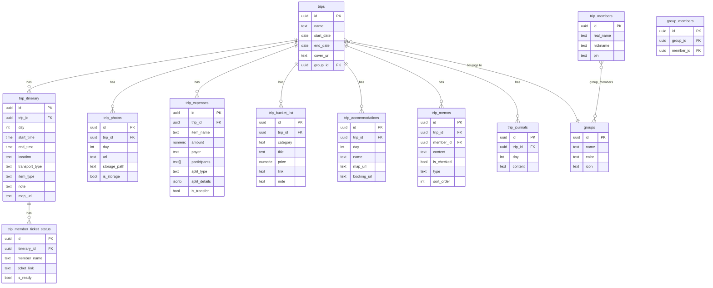

# Travel Record App — 專案完整分析報告

> 版本：v0.3.0 — Groups + Journal  
> 分析時間：2026-05-15

---

## 一、技術棧 (Tech Stack)

### 前端框架
| 項目 | 技術 |
|------|------|
| **Framework** | **Next.js 16.1.6**（App Router，全 `use client` 頁面） |
| **語言** | TypeScript 5 |
| **UI** | React 19 + TailwindCSS 4（PostCSS 整合） |
| **Icons** | Lucide React |
| **拖曳** | `@dnd-kit/core` + `@dnd-kit/sortable`（行程規劃看板） |
| **地圖** | `leaflet` + `react-leaflet`（依賴已安裝，尚未在現有頁面使用） |
| **試算表解析** | `xlsx` (SheetJS) |

### 後端設計
> 此專案**沒有自己的後端伺服器**。完全使用 **Supabase（BaaS）** 作為全端後端。

| 項目 | 細節 |
|------|------|
| **BaaS** | Supabase（PostgreSQL-based） |
| **API 方式** | 直接在前端使用 `@supabase/supabase-js` 操作資料庫 |
| **即時功能** | Supabase Realtime (`postgres_changes` channels)，行程頁和支出頁已啟用 |
| **檔案儲存** | Supabase Storage（`trip-covers` bucket 用於封面、`trip_photos` 記錄照片路徑） |
| **認證系統** | **無正式認證**，以 `localStorage` 儲存 `my_member_id`（4位 PIN 碼方式）識別身份 |
| **環境變數** | `NEXT_PUBLIC_SUPABASE_URL` + `NEXT_PUBLIC_SUPABASE_ANON_KEY` |

---

## 二、資料庫結構（Supabase PostgreSQL）

共 **10 張資料表**：



---

## 三、路由架構 (Next.js App Router)

```
/                         → 首頁：旅程列表 (archive)
/groups                   → 身份組管理
/members                  → 成員名冊
/trip/[id]                → 旅程行程細節（主頁）
/trip/[id]/plan           → 行程規劃看板（Beta）
/trip/[id]/memo           → 注意事項（Notion-style Memo）
/trip/[id]/journal        → 每日日記
/trip/[id]/expense        → 支出結算
/trip/[id]/photos         → 照片紀錄
```

---

## 四、功能清單（各頁功能）

### 🏠 首頁 `/`
- 顯示所有旅程的時間軸列表
- 旅程狀態標籤：**進行中** / **即將出發（N天後）** / **已結束（N天前）**
- 自動捲動至進行中的旅程
- 群組 Tab 篩選（依用戶所屬群組過濾）
- 新增 / 編輯 / 刪除旅程
- 封面圖上傳至 Supabase Storage
- 統計欄：總旅程數、總天數

### 🗺️ 行程細節頁 `/trip/[id]`
- 以天數選擇器切換（3D 視差滾輪效果）
- 每日行程時間軸，依交通工具分段顯示彩色 pill
- 卡片類型：一般行程、交通票券（TICKET LOG）、OPTIONAL 行程
- 支援**多景點 Map URL**（JSON 格式儲存多點連結）
- 住宿卡片顯示（地圖導航 + 訂房連結）
- 票券領取追蹤（每位成員的取票狀態）
- **試算表匯入**（支援橫向/縱向格式 .xlsx/.csv）
- **Realtime 即時同步**（多人同時使用時自動更新）

### 📐 行程規劃看板 `/trip/[id]/plan` (Beta)
- **試算表式 Grid 視圖**（時間軸 × 天數的二維排程板）
- **備選池 (Bucket List)**：景點/美食/住宿候選清單
- **拖曳指派**：@dnd-kit，將備選池項目拖入時間格
- 住宿區塊管理（可編輯地圖 + 訂房連結）
- 可調整顯示時間範圍（起始/結束小時）
- Day 0 切換選項（支援出發前一天）

### 📝 注意事項 `/trip/[id]/memo`
- Notion-style 記事本
- 支援：文字塊 (`text`)、大標題 (`heading1`)、待辦清單 (`todo`)
- 拖曳排序（sort_order）
- 可綁定特定成員或作為全員共用筆記

### 📖 每日日記 `/trip/[id]/journal`
- 每天一篇日記
- `trip_id + day` 唯一約束（upsert 機制）
- 簡單文字編輯儲存

### 💰 支出結算 `/trip/[id]/expense`
- 記錄每筆支出（代墊人 + 分攤對象）
- 分攤模式：**均分** 或 **自訂金額**
- **最佳結清路徑**算法（貪婪算法，最小化交易次數）
- **清帳功能**（一鍵記錄還款紀錄）
- 個人帳本視圖（篩選特定成員的收支明細）
- 墊付比例進度條（視覺化）
- **Realtime 即時同步**

### 📷 照片紀錄 `/trip/[id]/photos`
- 按天瀏覽相片（詳細頁面未完整閱讀，但表結構完備）
- 支援上傳至 Supabase Storage

### 👥 成員名冊 `/members`
- 新增/編輯成員（暱稱、真實姓名、4位PIN）
- 用 localStorage 記錄「自己的 member_id」

### 🏷️ 身份組 `/groups`
- Discord 風格群組（名稱 + 顏色 + Emoji 圖標）
- 成員加入多個群組（多對多）
- 旅程依群組隱私控制（只顯示自己所屬群組的旅程）

---

## 五、共用元件 (`/components`)

| 元件 | 用途 |
|------|------|
| `Sidebar.tsx` | 左側抽屜式導覽（含 CURRENT TRIP 子選單） |
| `BottomTabs.tsx` | 行動端底部 Tab Bar |
| `Modal.tsx` | 通用 Modal 包裝器 |
| `Toast.tsx` | 通知訊息（success/error/warning/info） |
| `ConfirmDialog.tsx` | 確認對話框（含 danger 模式） |
| `Lightbox.tsx` | 圖片放大燈箱 |
| `Skeleton.tsx` | 各頁載入骨架屏 |
| `SpreadsheetImport.tsx` | 試算表解析匯入（橫向/縱向格式自動偵測） |

---

## 六、問題分析（重構前的觀察）

### ⚠️ 架構問題

1. **頁面超大** — `page.tsx` 動輒 400～550 行，包含全部邏輯、狀態、UI，完全沒有分離
2. **無 API 層** — 所有 Supabase 查詢直接散佈在各頁面/元件的 `fetchData()` 函式中，無集中資料管理
3. **無狀態管理** — 沒有 Context / Zustand / Redux，跨頁面共享資料靠 URL 參數和重新 fetch
4. **認證系統薄弱** — PIN + localStorage，無 Supabase Auth，所有資料表完全沒有 Row Level Security (RLS) 保護
5. **資料重複取得** — 每次 `fetchData()` 會重新抓所有資料（含 `trip_members` 等全局資料）
6. **`localStorage` 為主** — Day 0 偏好設定存在 `localStorage`，多裝置不同步

### 🟡 功能缺口

7. **`react-leaflet` 依賴已安裝但未使用** — 尚未有地圖整合頁面
8. **`trip_memos` 的 `title` 欄位** — 型別定義有 `title`，但部分 SQL 未包含
9. **照片功能未完整** — photos 頁面結構存在但未深入閱讀，需確認刪除流程
10. **沒有 Loading/Error 邊界** — 無 React ErrorBoundary，API 失敗只靠 Toast

---

## 七、重構建議方向（供參考）

| 優先級 | 項目 | 方向 |
|--------|------|------|
| 🔴 高 | 引入資料管理層 | Custom hooks (`useTrip`, `useExpenses`) 或 React Query / SWR |
| 🔴 高 | 頁面元件拆分 | 每頁面拆出子元件，頁面只做組裝 |
| 🟠 中 | 真正的認證系統 | Supabase Auth + RLS，取代 PIN+localStorage |
| 🟠 中 | 全局狀態管理 | Zustand 或 Context 統一管理成員列表、當前旅程等 |
| 🟡 低 | 地圖整合 | 啟用已安裝的 leaflet，加入地圖視圖 |
| 🟡 低 | 多語系 / i18n | 目前中文硬編碼 |
